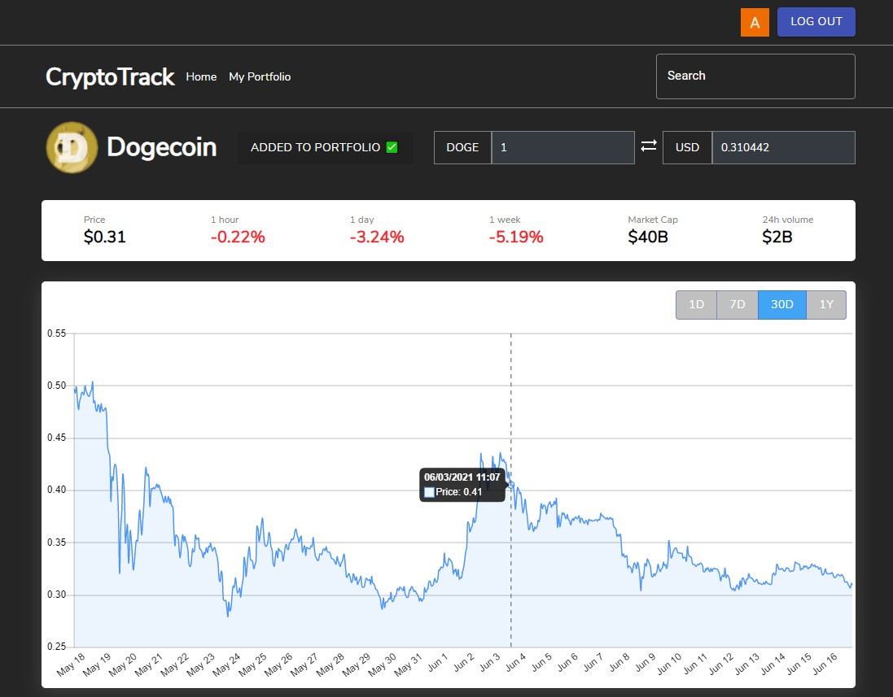
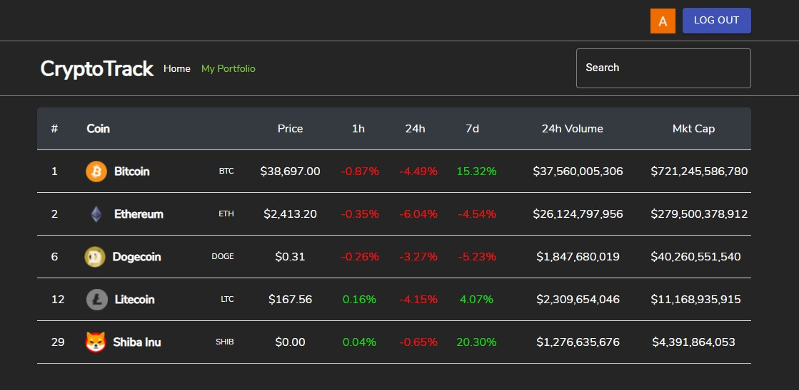

# CryptoTrack
CryptoTrack is a web application that allows users to track the price, market capitalization, and many other cryptocurrency metrics of thousands of coins and tokens currently being traded on the blockchain. The web app leverages the [CoinGecko API](https://www.coingecko.com/en/api) to gather and display reliable live market data of over 7,000 different cryptocurrencies.

# Screenshots
Search for coins, track their statistics, and add them to your portfolio
  

  
Login using Auth0's secure authentication process
  

Keep track of your favorite coins in your own portfolio
  

 Built with React, Node, Express, and MySQL.
